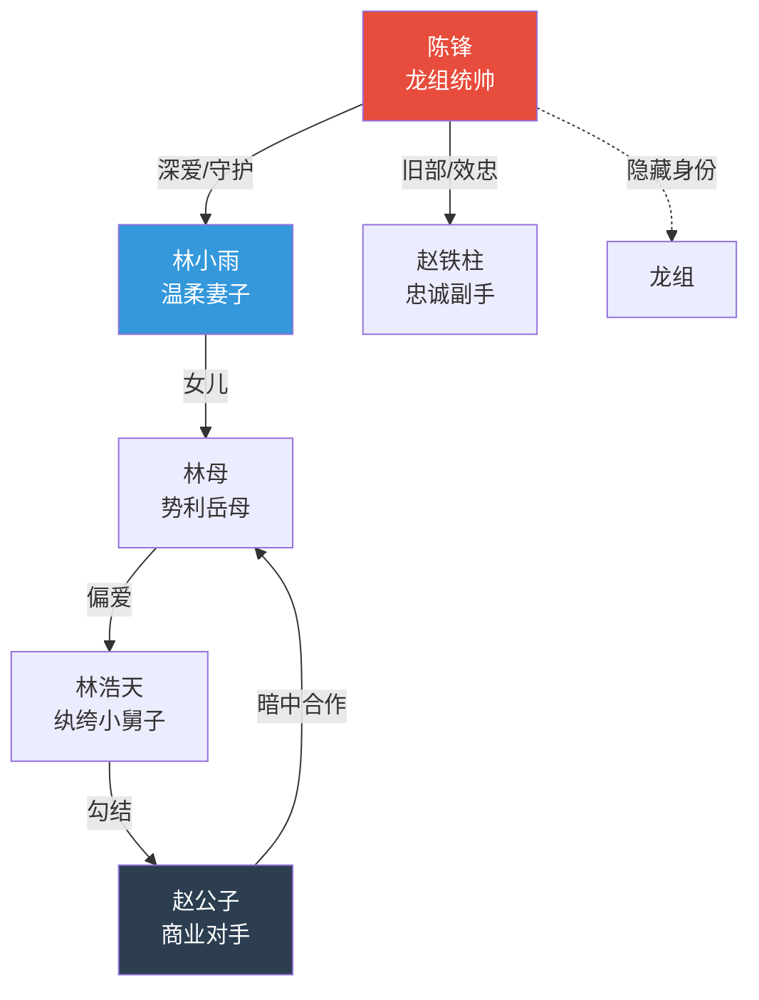

# 角色开发规范

## 角色体系

短剧角色精简而鲜明。不需要复杂的内心世界，但需要一眼能记住的特征和清晰的功能定位。

### 角色配额

| 类型 | 数量 | 要求 |
|------|------|------|
| 主角 | 1-2人 | 最完整的角色设计，观众代入的对象 |
| 核心配角 | 3-5人 | 围绕主角的关键人物（爱人、对手、盟友） |
| 功能角色 | 3-5人 | 推动特定剧情的角色（反派手下、助攻好友） |
| 临时角色 | 按需 | 单集出场，功能性强，简单带过 |

总计：主要角色5-7人，次要角色不超过5人。

## 角色信息表

为每个主要角色创建以下信息表：

| 字段 | 说明 | 示例 |
|------|------|------|
| **角色名称** | 姓名 + 别称/代号 | 陈锋（代号：龙主） |
| **身份定位** | 在故事中的功能角色 | 男主角 / 隐世强者 |
| **年龄外貌** | 简洁直观的外貌特征 | 28岁，面容俊朗但常年隐忍，左手无名指戴黑色戒指 |
| **性格特征** | 2-3个核心性格词 | 隐忍、深情、果断 |
| **公开身份** | 别人以为他/她是 | 林家赘婿，无业游民 |
| **真实身份** | 实际上他/她是 | 龙组至高统帅，身家千亿 |
| **当前目标** | 这个阶段最想做什么 | 完成三年守护承诺，守护妻子 |
| **核心动机** | 为什么要这么做 | 报答救命恩情 + 对妻子的爱 |
| **冲突点** | 角色面临的主要矛盾 | 真实身份与卑微人设的冲突 |
| **爽点功能** | 这个角色在爽点设计中的作用 | 身份揭露时的碾压感、为妻子出头时的霸气 |

### 表格模板

```markdown
| 角色名称 | 身份定位 | 年龄外貌 | 性格特征 | 公开/真实身份 | 目标动机 | 冲突点 | 爽点功能 |
|----------|----------|----------|----------|--------------|---------|--------|----------|
| ？ | ？ | ？ | ？ | ？/？ | ？ | ？ | ？ |
```

## 角色弧线设计

即使是爽剧，主角也需要成长变化。角色弧线是观众持续追剧的深层动力。

### 主角弧线模板

```
起点状态 → 催化事件 → 初次觉醒 → 能力展现 → 挫折考验 → 终极蜕变
```

| 阶段 | 集数范围 | 主角状态 | 示例 |
|------|---------|---------|------|
| 起点 | 1-3集 | 被压抑/隐忍/底层 | 赘婿被全家嘲笑 |
| 觉醒 | 3-10集 | 开始展现实力/反击 | 接到旧部电话，开始行动 |
| 崛起 | 10-25集 | 逐步展露身份和力量 | 一次次化解危机，身份逐渐暴露 |
| 低谷 | 25-35集 | 遭遇重大挫折 | 妻子被绑架/被最信任的人背叛 |
| 爆发 | 35-50集 | 全面反击，不再隐忍 | 真实身份完全公开，碾压所有敌人 |
| 封神 | 50-60集 | 站上顶峰，终极胜利 | 所有问题解决，获得幸福/权力/认可 |

### 反派弧线模板

```
嚣张得意 → 初次受挫 → 加码反击 → 暂时得逞 → 全面溃败 → 跪地求饶
```

好的反派弧线和主角弧线是镜像的——主角上升时反派下降，反派暂时得逞时主角处于低谷。

### 感情线弧线模板（如有）

```
初遇/误解 → 日久生情 → 互相试探 → 确认心意 → 被迫分离 → 最终在一起
```

## 角色关系设计

### Mermaid关系图

使用Mermaid语法生成角色关系图，清晰展示所有主要角色间的关系。

示例模板：



关系图要求：
- 标注关系性质（亲属、爱情、敌对、效忠、暗中合作等）
- 用不同颜色区分阵营（主角方、反派方、中立方）
- 随剧情发展更新关系图
- 用虚线表示隐藏关系或待揭露的关系

## 角色设计原则

### 1. 一句话能说清

每个角色必须能用一句话定义：
- "隐忍三年的绝世强者"
- "欺软怕硬的势利岳母"
- "外表甜美内心毒辣的白莲花"

如果一句话说不清，说明角色太复杂了，需要精简。

### 2. 外貌即性格

短剧没有时间慢慢展示角色内心，外貌特征要直接暗示性格：
- 冷面战神 → 刀疤、军姿、冷眼
- 甜美女主 → 干净清纯、笑容温暖
- 嚣张反派 → 名牌堆身、翘二郎腿、嘴角带笑

### 3. 台词即人设

角色的第一句台词就要建立人设：
- 霸道总裁："全世界都可以说不，但你不行。"
- 隐忍战神："三年够了。"
- 势利岳母："我们林家的门，不是什么人都能进的。"

### 4. 冲突即关系

角色间的关系通过冲突来定义和深化，而不是通过对话解释：
- 不要："他是我的情敌"（旁白告知）
- 要：两个男人同时伸手扶住女主，四目相对，火花四溅（行动展示）

### 5. 每个角色为爽点服务

问自己：这个角色的存在，能为哪个爽点场景服务？如果答不上来，要么调整角色定位，要么删除这个角色。

## 角色互动场景预设

在角色开发完成后，为以下关键互动场景做预设：

| 互动类型 | 涉及角色 | 预设场景 |
|----------|---------|---------|
| 第一次正面冲突 | 主角 vs 主反派 | 什么场景、什么导火索 |
| 感情确认 | 男主 vs 女主 | 什么事件促使感情升温 |
| 身份揭露 | 主角 vs 全体 | 在什么场合、以什么方式 |
| 终极对决 | 主角 vs 终极BOSS | 对决形式和场景 |
| 和解/原谅 | 主角 vs 曾经伤害他的人 | 是否原谅，如何处理 |

完成角色开发后，引导用户输入 `/目录`。
